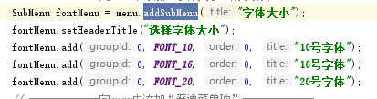
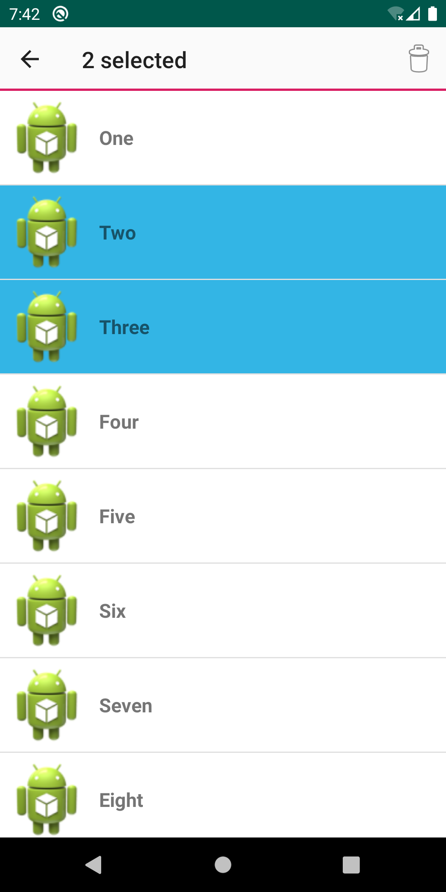

# SimpleAdapter

在activity_main.xml中创建线性列表视图listview

创建一个layout实现每个列表的布局simple_item

定义数据：将图片存在drawable中，new一个int数组对象存放drawable对象，new一个字符串数组存放名字

再将数据存放list[HashMap]中

创建构造器

```
SimpleAdapter simpleAdapter = new SimpleAdapter(this, list[HashMap],
        R.layout.simple_item, new String[]{"Name", "header"},
        new int[]{R.id.name, R.id.header});
```

调用setAdapte为listview设置adapter

为listview绑定点击事件setOnItemClickListener()，获得点击列表在适配器中的位置position

使用toast打印name[position]即可得到对应列表的名字


# AlertDialog

在activity_main.xml中添加一个按钮，在MainActivity中构造按钮点击监听函数customView(View source) 

new一个AlertDialog对象，用setView（view）将login.xml设置为AlertDialog页面

调用show（）方法显示AlertDialog

当点击按钮后弹出登录页面


# XmlMenu

layout中定义一个文本视图

MainActivity中定义重构onCreateOptionsMenu(MenuItem menu)函数

在其中调用addSubMenu()添加菜单选项,add()添加菜单子项



重构onOptionsItemSelected(MenuItem menu)函数，点击选项后的回调方法

getItemId()获取点击的菜单标识ID，再针对不同ID处理


运行后发现并没有菜单选项，处理方法：

layout中添加toolbar：

```
<com.google.android.material.appbar.AppBarLayout
    android:layout_width="match_parent"
    android:layout_height="wrap_content">
    <androidx.appcompat.widget.Toolbar
        android:id="@+id/toolbar"
        android:layout_width="match_parent"
        android:layout_height="?attr/actionBarSize"
        android:background="?attr/colorPrimary" />
</com.google.android.material.appbar.AppBarLayout>
```

在oncreate()中使用ToolBar控件替代ActionBar控件：

```
Toolbar toolbar = findViewById(R.id.toolbar);
setSupportActionBar(toolbar);
```

最后MainActivity继承ActionBarActivity类或者AppCompatActivity类。


# ActionMode

