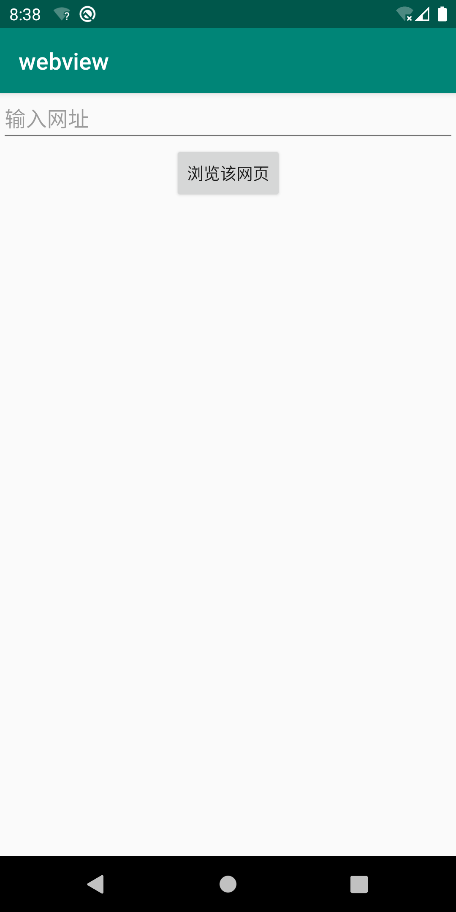
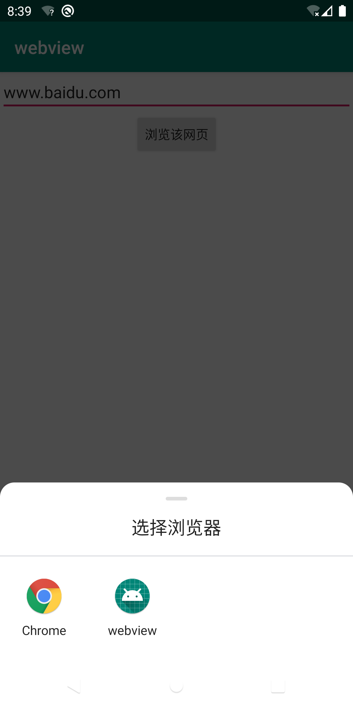
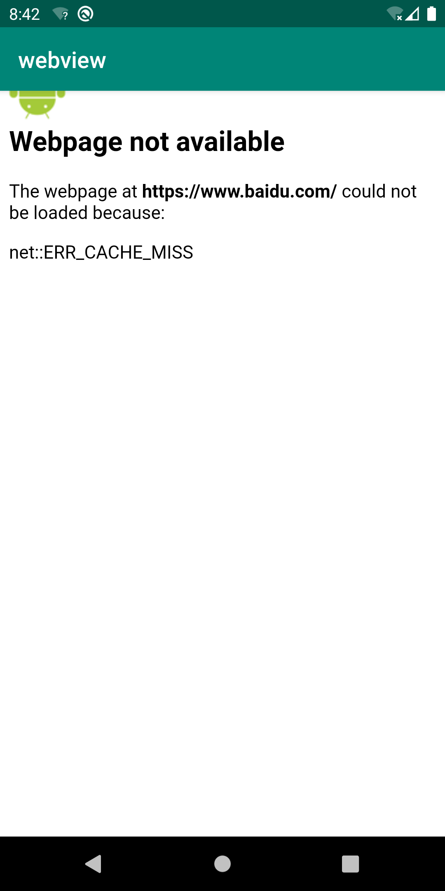
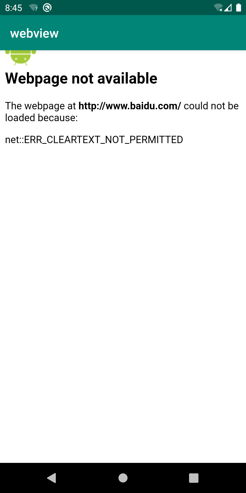
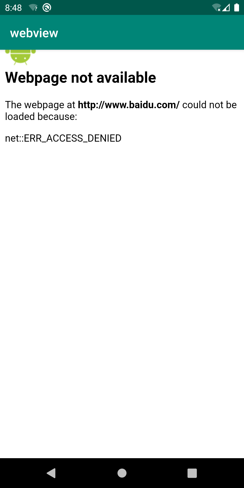
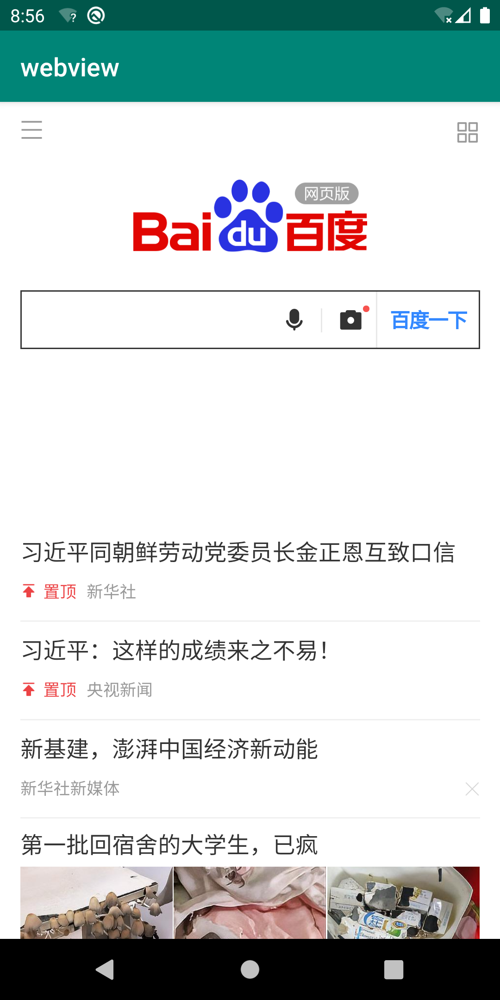

# 自定义webview

新建一个名为webview.xml的layout

在其中添加webview视图

```
<WebView
        android:layout_width="match_parent"
        android:layout_height="match_parent"
        android:id="@+id/web">
</WebView>
```

新建一个名为webview.java的activity，在其中初始化webview对象，接收其他activity传来的url网址，设置webview对象来打开url网站


在主页面中添加输入框，按钮，主activity获取输入框里的url，设置隐式intent。

在AndroidManifest.xml中设置自定义webview的过滤器标签节点来描述意图

```
<activity android:name=".webview">
    <intent-filter>
        <action android:name="android.intent.action.VIEW"></action>
        <data android:scheme="http"/>
        <category android:name="android.intent.category.DEFAULT"/>
    </intent-filter>
</activity>
```

程序主界面



输入网址点击按钮，弹出程序进行选择



选择自定义的webview

无法正常访问网页



搜索到解决方法，在AndroidManifest.xml里加入联网权限

```
<uses-permission android:name="android.permission.INTERNET" />
```

再次运行，依然无法访问，另一个报错



再次查找解决方法，在AndroidManifest.xml中添加

```
android:usesCleartextTraffic="true"
```

再次运行，依然失败



继续搜索这个问题，找到了解决方案，附上[原作者地址](https://blog.csdn.net/JimFire/article/details/104478156?utm_medium=distribute.pc_relevant.none-task-blog-BlogCommendFromMachineLearnPai2-1&depth_1-utm_source=distribute.pc_relevant.none-task-blog-BlogCommendFromMachineLearnPai2-1)

