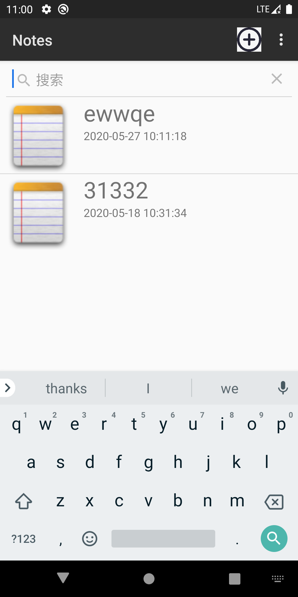
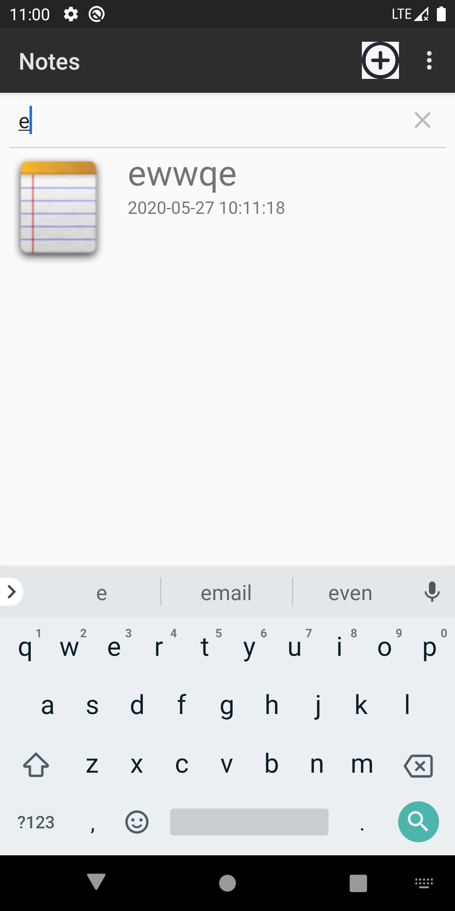
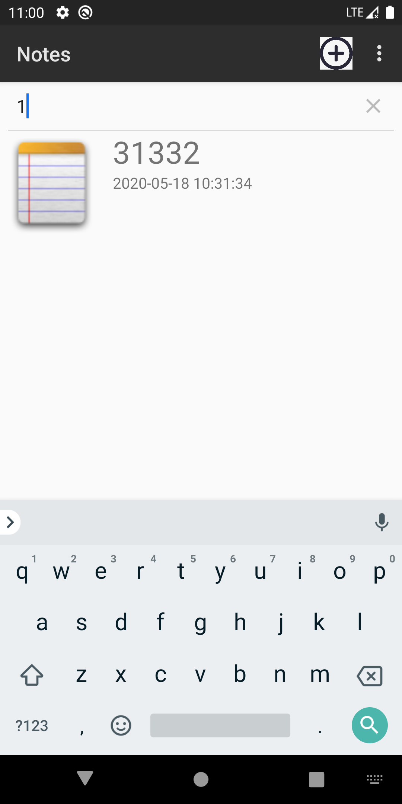

# NotePad修改

### 添加笔记时间

在notepad类中添加COLUMN_NAME_MODIFICATION_DATE，作为笔记添加或者修改时间

在noteslist_item.xml中添加TextView

```
<TextView
            android:id="@android:id/text2"
            android:layout_width="wrap_content"
            android:layout_height="wrap_content"
            android:paddingLeft="10dp"
            android:textSize="15sp" />
```

在NotesEditor.java中添加获取当前时间的函数

```
public static String getStandardTime(){
    SimpleDateFormat sdf = new SimpleDateFormat("yyyy-MM-dd HH:mm:ss");
    Date date = new Date(System.currentTimeMillis());
    String time = sdf.format(date);
    return time;
}
```

修改NotesEditor.java中的updateNote函数，添加时间参数，并将时间插入values

```
values.put(NotePad.Notes.COLUMN_NAME_MODIFICATION_DATE, modification_date);
```

再修改其他调用了updateNote的代码，将时间参数补上

接下来再修改NotesList.java,将时间传给listview

修改PROJECTION添加COLUMN_NAME_MODIFICATION_DATE对象，这样cursor才能获取到时间

```
private static final String[] PROJECTION = new String[] {
        NotePad.Notes._ID, // 0
        NotePad.Notes.COLUMN_NAME_TITLE, // 1
        NotePad.Notes.COLUMN_NAME_MODIFICATION_DATE   //2
};
```

修改dataColumns和viewIDs

```
String[] dataColumns = { NotePad.Notes.COLUMN_NAME_TITLE ,NotePad.Notes.COLUMN_NAME_MODIFICATION_DATE  } ;
int[] viewIDs = { android.R.id.text1 ,android.R.id.text2};
```

将上面两个参数传给adapter

```
adapter = new SimpleCursorAdapter(
              this,   
              R.layout.noteslist_item,
              cursor,
              dataColumns,
        	  viewIDs
      );
```

调用setAdapter将数据映射到listview，这样就会显示时间参数了


但是，我发现每当我进入某个笔记，我按返回依旧会将时间修改，于是我删除了原本NoteEditor中的cancel函数  重写onBackPressed()函数监听点击返回按钮，如果是编辑模式就关闭mCursor，不做其他操作，如果是新建模式，则将新建的笔记删除

```
//取消操作
    @Override
    public void onBackPressed() {
        super.onBackPressed();
        if (mCursor != null) {
            if (mState == STATE_EDIT) {
                mCursor.close();
                mCursor = null;
            } else if (mState == STATE_INSERT) {
                // We inserted an empty note, make sure to delete it
                deleteNote();
            }
        }
        setResult(RESULT_CANCELED);
        finish();
    }
```

这样时间就不会在没有点击保存的情况下改变

### 添加搜索功能

我查找了searchView的用法，都是将它写在layout中，在java里使用findViewById()赋值之后对其进行设置，但原本的listview是通过继承ListActivity，不是在layout中添加listview，我不知道怎么添加searchView，所以改写了listview，将其写在layout中，这样searchView也写在layout里

我添加了main.xml

```
<?xml version="1.0" encoding="utf-8"?>
<LinearLayout xmlns:android="http://schemas.android.com/apk/res/android"
    android:orientation="vertical" android:layout_width="match_parent"
    android:layout_height="match_parent">

    <SearchView
        android:id="@+id/search"
        android:layout_width="match_parent"
        android:layout_height="wrap_content"
        />
    <!-- 定义一个ListView -->
    <ListView android:id="@+id/mylist"
        android:layout_width="match_parent"
        android:layout_height="wrap_content"/>
</LinearLayout>
```

修改NotesList，继承改为Activity，

ListView list = = findViewById(R.id.mylist);

再将设置list的方法修改下，例如（setlistAdapter(adapter);改为list.setAdapter(adapter);）就改写完成了

接下来再添加SearchView函数

```
private void SearchView(){
    searchView=findViewById(R.id.search);
    //设置没输入时的提示文字
    searchView.setQueryHint("搜索");
    searchView.setOnQueryTextListener(new SearchView.OnQueryTextListener() {
        @Override
        //当提交时
        public boolean onQueryTextSubmit(String s) {
            return false;
        }
        // 当输入修改时
        @Override
        public boolean onQueryTextChange(String text) {
            Cursor cursor;
            String selection=null;
            if(!text.equals("")){
                //查询条件
                selection=NotePad.Notes.COLUMN_NAME_TITLE+" GLOB '*"+text+"*'";
            }
            cursor =  managedQuery(
                    getIntent().getData(),
                    PROJECTION,
                    selection,
                    null,
                    NotePad.Notes.DEFAULT_SORT_ORDER
            );
            adapter.swapCursor(cursor);
            return false;
        }
    });
}
```

最后再onCreate中调用该方法即可





